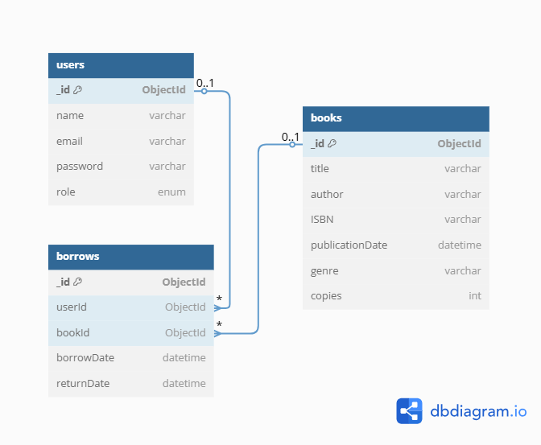

# 📚 Nalanda Library Management System - Backend

A robust backend system for managing a digital library using **Node.js**, **Express**, **MongoDB**, and **JWT Authentication**. Supports both **RESTful** and **GraphQL** APIs with role-based access control for Admin and Member users.

🌐 **Live Deployment**:

- Backend URL: <https://nalanda-library.akash-building.space>
- API Docs (Swagger): <https://nalanda-library.akash-building.space/api-docs/>

---

## 🚀 Features

### ✅ User Management

- Register & Login (JWT Auth)
- Roles: `Admin`, `Member`
- Encrypted passwords using `bcryptjs`

### ✅ Book Management (Admin Only)

- Add, update, delete books
- List books with filtering & pagination

### ✅ Borrowing System

- Members can borrow & return books
- View personal borrow history

### ✅ Reports (Admin)

- Most Borrowed Books
- Active Members
- Book Availability Report (Total, Borrowed, Available)

### ✅ GraphQL API

- Mirrors all REST functionality
- Resolvers with full error handling
- Clean schema and modular design

---

## 🧱 Tech Stack

| Layer        | Technology                         |
| ------------ | ---------------------------------- |
| Language     | JavaScript (Node.js)               |
| Backend      | Express.js                         |
| Database     | MongoDB + Mongoose ORM             |
| Auth         | JWT + bcrypt                       |
| APIs         | REST & GraphQL (`express-graphql`) |
| Deployment   | (Optional) AWS EC2 / Render        |
| Version Ctrl | Git / Bitbucket (optional)         |

---

## 📁 Folder Structure

## 🧱 Architecture Overview

### Core Layers:

| Layer       | Directory/File | Description                             |
| ----------- | -------------- | --------------------------------------- |
| Config      | `config/db.js` | MongoDB connection logic                |
| Models      | `models/`      | Mongoose schemas for User, Book, Borrow |
| Controllers | `controllers/` | REST API business logic                 |
| Routes      | `routes/`      | REST route endpoints                    |
| Middleware  | `middleware/`  | JWT & role authorization                |
| GraphQL     | `graphql/`     | Schema, resolvers, context              |
| Utils       | `utils/`       | Token gen, custom error classes         |

## 🧬 Database Schema Design (MongoDB)

The following diagram illustrates the relationships between the key collections: `User`, `Book`, and `Borrow`.

## 🛠️ Setup Instructions

### 1. Clone the Repository

git clone https://akashreddy23-admin@bitbucket.org/akashreddy23/nalanda-library-backend.git
cd nalanda-library-backend

### 2. Install Dependencies

npm install

### 3. Configure Environment

Create a .env file:

PORT=5000
MONGO_URI=mongodb://localhost:27017/nalanda
JWT_SECRET=your_super_secret

### 4. Run the Server

npm run start
npm run server # For development (nodemon)

## 🔐 Authentication

JWT Format:
Token sent via Authorization header:
Authorization: Bearer <token>

Contains user \_id, role, and expires in 1 day

## 🔗 API Endpoints

### REST Endpoints

| Method | Endpoint             | Description              |
| ------ | -------------------- | ------------------------ |
| POST   | `/api/auth/register` | Register a new user      |
| POST   | `/api/auth/login`    | Log in and receive token |
| GET    | `/api/books`         | List all books           |
| POST   | `/api/books`         | Add a new book (Admin)   |
| PUT    | `/api/books/:id`     | Update a book (Admin)    |
| DELETE | `/api/books/:id`     | Delete a book (Admin)    |
| POST   | `/api/borrow`        | Borrow a book            |
| POST   | `/api/return`        | Return a borrowed book   |

### Swagger Docs

Access interactive REST API documentation at: <https://nalanda-library.akash-building.space/api-docs/>

## 📡 GraphQL API

▶️ Endpoint:

POST http://localhost:5000/graphql

### 🧪 Example Queries

Register

mutation {
register(input: {
name: "Alice",
email: "alice@example.com",
password: "secure123"
}) {
token
}
}

List Books

query {
books(genre: "Fiction") {
title
author
copies
}
}

Borrow Book

mutation {
borrowBook(bookId: "book_id_here") {
id
borrowDate
}
}

## 🔐 Role-Based Access Control

Implemented via:

middleware/auth.js: JWT verification

middleware/role.js: Role validation for REST

graphql/resolvers.js: Role checks in resolvers

Example:

if (!context.user || context.user.role !== 'Admin')
throw new ForbiddenError();

Only authenticated users can access GraphQL & REST, and only Admins can perform restricted operations.

## ⚠️ Error Handling

All GraphQL resolvers use try-catch

Central error types in utils/errors.js:

UnauthorizedError

ForbiddenError

ValidationError

NotFoundError

REST errors follow similar structure for consistency.

## 🧪 Testing

Use tools like:

Postman (REST)

GraphQL Playground (GraphQL queries/mutations)

MongoDB Atlas (visual DB viewer)

## 🚀 Optional Deployment (AWS EC2)

SSH into EC2 and install:

sudo apt update
sudo apt install nodejs npm
Install MongoDB (or use Atlas)

Setup environment variables and pm2:

npm install pm2 -g
pm2 start server.js
(Optional) Use NGINX + Certbot for HTTPS

## 📂 Version Control

Use git and push code to:

GitHub

Bitbucket (as requested)

Make meaningful commits and include .gitignore.

## 👨‍💻 Author

**Panyala Akash Reddy**  
Email: akashreddy2305@gmail.com
